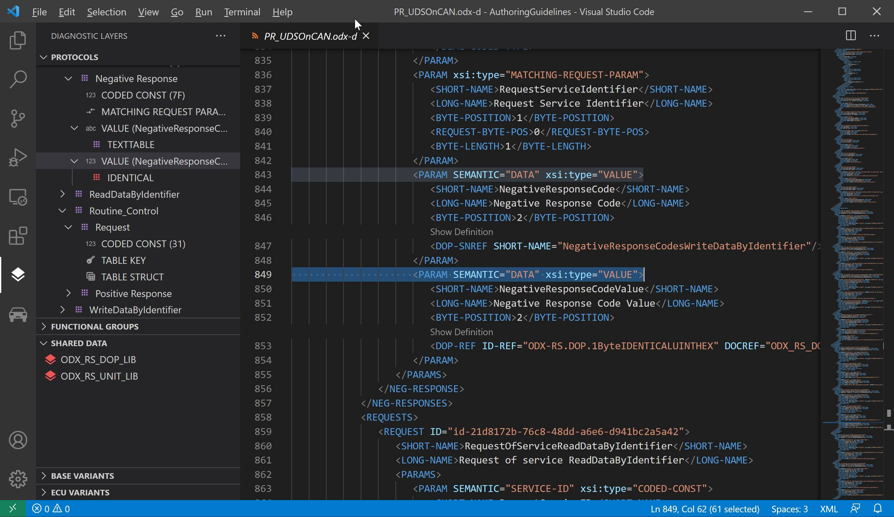

# ODX Commander

## Features

ODX Commander is a sophisticated VS-Code extension that allows fast navigation through large diagnostic data sets available in ODX format. After installation there are two additional view groups on the left:

The first group shows detailed information about all diagnostic layer containers and appropriate structure for

* Protocols (Purple)
* Functional Groups (Blue)
* Shared Data (Red)
* Base Variants (Yellow)
* ECU Variants (Green)

Each layer is represented by a unique color to simply indicate the hierarchy location of all diagnostic elements.

The second group shows the structure of all other remaining ODX categories

* Vehicle Information
* Comparams
* Comparam Subsets
* ECU Config
* Function Dictionaries
* ECU Jobs
* Flash Data

## Getting Started

The most important step when using ODX commander is selecting an ODX data source. There are three options available:

1. Open the folder that conatais the PDX file to use and 
2. Open the folder that contains unpacked ODX files and 
3. Set the configuration property in VS code

## Requirements

Java 8 or higher must be installed on your system.

## Known Issues

Unknown

## Release Notes

- Support for packed (PDX) and unpacked ODX files
- Hyperlink support for all ODX-Links in XML files
- The editor shows simplified and formatted ODX documents (e.g. removes admin data, company data, oids ...)

### 0.1.0

Initial release of ODX Viewer

