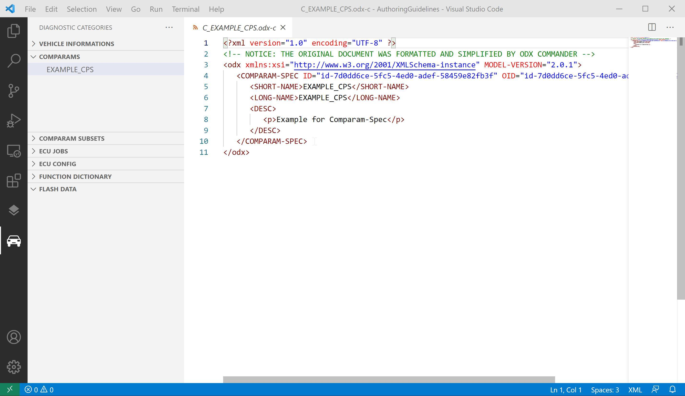

# ODX Viewer

## Features

Where [Total Commander](https://www.ghisler.com/deutsch.htm) allows easy navigation through your filesystems, ODX Commander helps to understand and navigate through complex diagnostic data structures available in ODX format.

The extension brings two additional view groups into VS Code:
One for diagnostic layers:

One for all the other ODX Categories:

## Requirements

Requires Java 8 or higher

## Known Issues

Unknown

## Release Notes

- Readonly PDX support
- Hyperlink support for all ODX-Links in XML editors

### 1.0.0

Initial release of ODX Viewer

