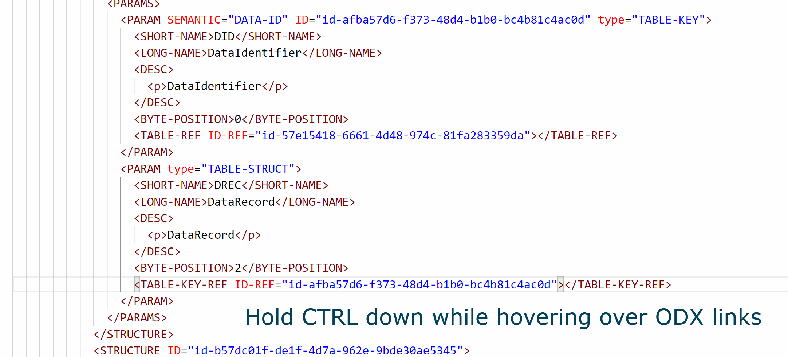
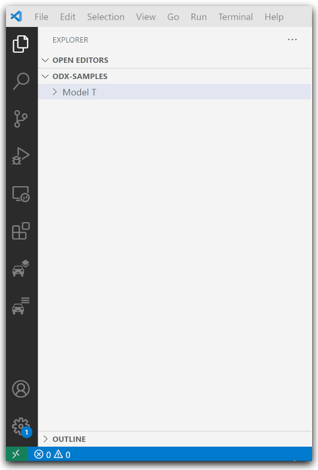
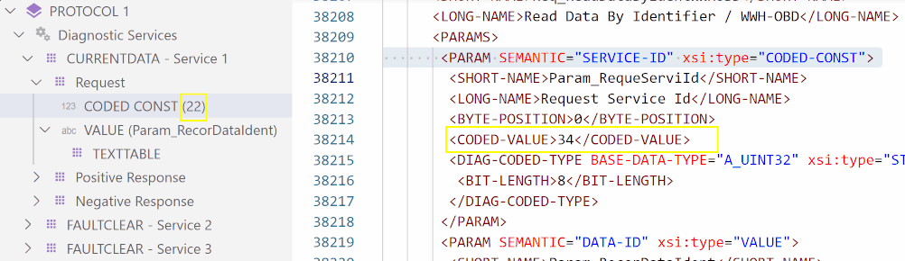
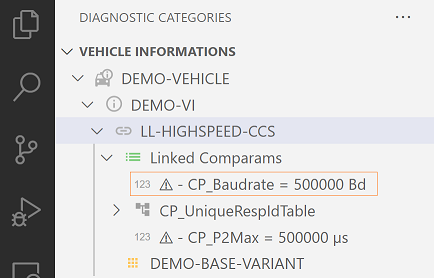

# ODX Commander

1. [Introduction](#Introduction)
1. [Getting Started](#Getting-Started)
1. [Diagnostic Layers](#Diagnostic-Layers)
1. [Diagnostic Categories](#Diagnostic-Categories)

## Introduction

[Visual Studio Code](https://code.visualstudio.com/) extension that allows easy to handle navigation through large diagnostic data sets in [ODX](https://www.asam.net/standards/detail/mcd-2-d/) format. The extension provides additional views and commands for ODX data browsing in the workbench.

### Goto definition support for ODX links

### Advanced viewer that shows logical structure for active ODX index

### Editing capabilities for unpacked ODX files

## Getting Started 

Before you can browse any data you have to select an appropriate ODX data source by one of the following options:

- Open a folder that contains the PDX file in VS Code and select _**'Set or Update ODX Index'**_ in the context menu of the selected PDX file.

- Open a folder that contains all unpacked ODX files in VS Code and select _**'Set or Update ODX Index'**_ in the context of the selected folder or any contained ODX file.

- Both options above will automatically update the extension configuration _**'Active Index Location'**_ which you can also set in the settings editor directly.

## Diagnostic Layers

The **Diagnostic Layers** container shows layer related information and the appropriate structure for

* Protocols (Purple)
* Functional Groups (Blue)
* Shared Data (Red)
* Base Variants (Yellow)
* ECU Variants (Green)

Each layer is represented by a distinct color to indicate at which location in the ODX hierarchy a diagnostic element is defined. (e.g. if the request's icon is a yellow square the request is defined in a base variant)

## Diagnostic Categories

The **Diagnostic Categories** container shows information for the remaining ODX categories

* Vehicle Informations
* Comparams
* Comparam Subsets
* ECU Config
* Function Dictionaries
* ECU Jobs
* Flash Data

### Vehicle Information

**Vehicle Informations** overview lists all available **_VEHICLE-INFO-SPEC_** documents in the current ODX index and highlights most relevant information in a simple tree structure.

For any logical link that configures communication parametes via **_LINK-COMPARAM-REF_** all that parameters, values and appropriate units are shown. Parameter values that vary from their physical default values are prepended with a warning icon.

For convenience the logical links **_BASE-VARIANT-REF_** target is selectable in the tree.

## Requirements

Java 8 or higher must be installed on your system.

## Known Issues

Unknown

