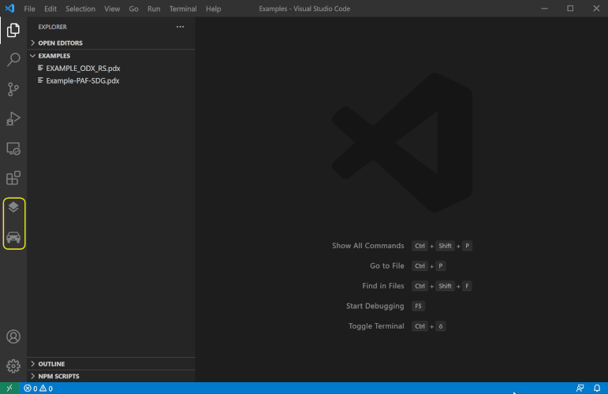

# ODX Commander

[Visual Studio Code](https://code.visualstudio.com/) extension that allows easy to handle navigation through large diagnostic data sets in [ODX](https://www.asam.net/standards/detail/mcd-2-d/) format. The extension provides additional views and commands for ODX data browsing in the workbench.

## Features

### Diagnostic Layers

The **Diagnostic Layers** container shows layer related information and the appropriate structure for

* Protocols (Purple)
* Functional Groups (Blue)
* Shared Data (Red)
* Base Variants (Yellow)
* ECU Variants (Green)

Each layer is represented by a distinct color to indicate at which location in the ODX hierarchy a diagnostic element is defined. (e.g. if the request's icon is a yellow square the request is defined in a base variant)

### Diagnostic Categories

The **Diagnostic Categories** container shows information for the remaining ODX categories

* Vehicle Information
* Comparams
* Comparam Subsets
* ECU Config
* Function Dictionaries
* ECU Jobs
* Flash Data

## Getting Started

Before you can browse any data you have to select an appropriate ODX data source by one of the following options:

Open a folder that contains the PDX file in VS Code and select _**'Set or Update ODX Index'**_ in the context menu of the selected PDX file.

Open a folder that contains all unpacked ODX files in VS Code and select _**'Set or Update ODX Index'**_ in the context of the selected folder or any contained ODX file.

Both options above will automatically update the extension configuration _**'Active Index Location'**_ which you can also set in the settings editor directly.

## Requirements

Java 8 or higher must be installed on your system.

## Known Issues

Unknown

## Release Notes

- Support for packed (PDX) and unpacked ODX files
- Hyperlink support for ODX Links in XML files
- The editor shows simplified and formatted ODX documents (e.g. removes admin data, company data, oids ...)

### 0.1.0

- Initial ODX Commander release

## Development

### Local development

1. Run `npm install`
2. Start the odx-language-server as described in the [readme](https://github.com/javahacks/odx-language-server/blob/main/README.md)
3. Open this project using Visual Studio Code and install the recommended plugins
4. Start launch configuration `Run Extension`
