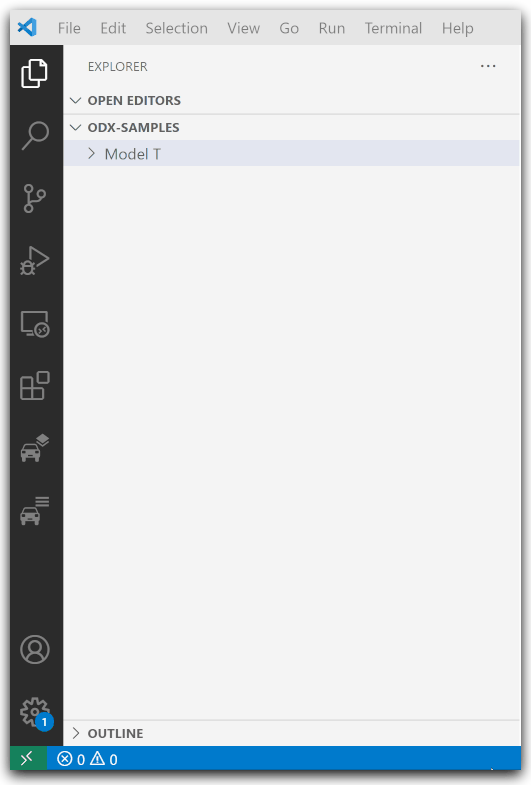
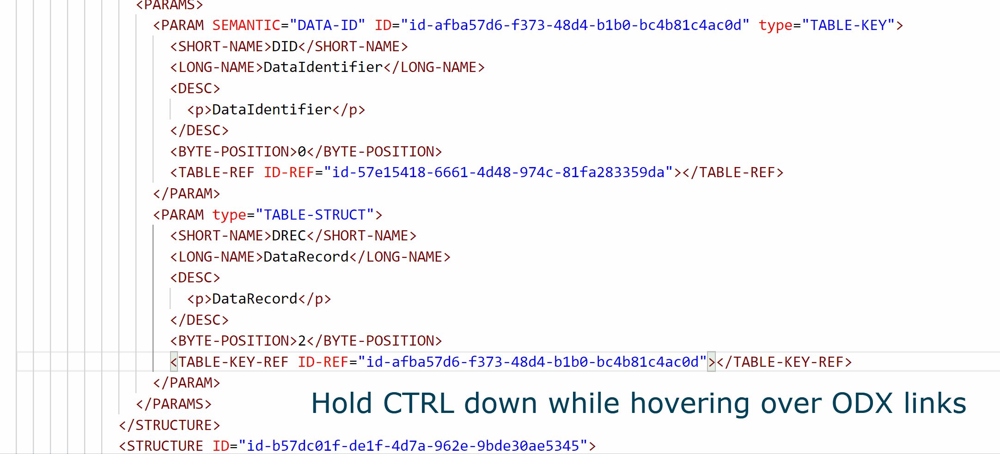
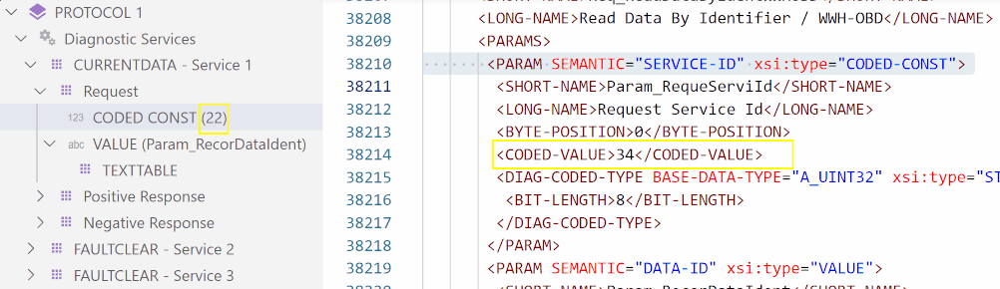
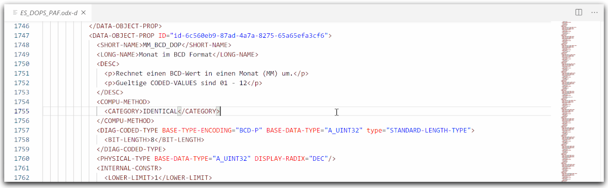
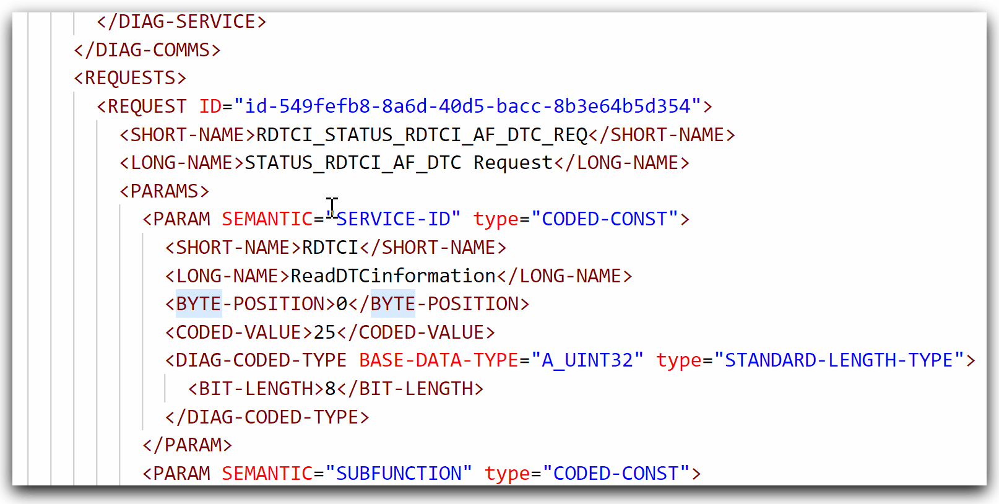
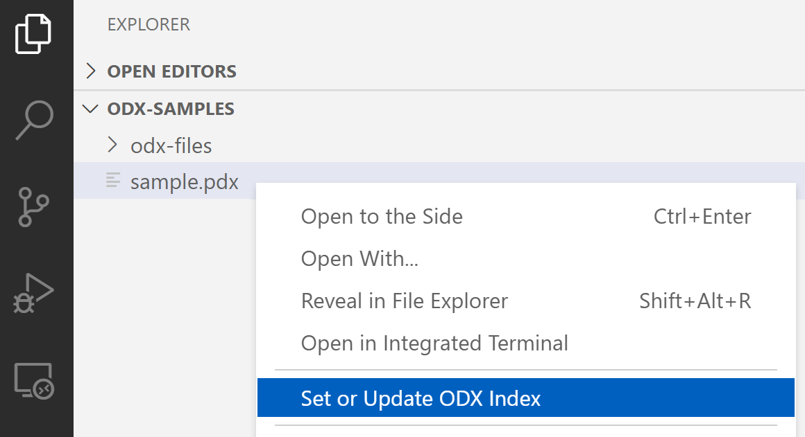
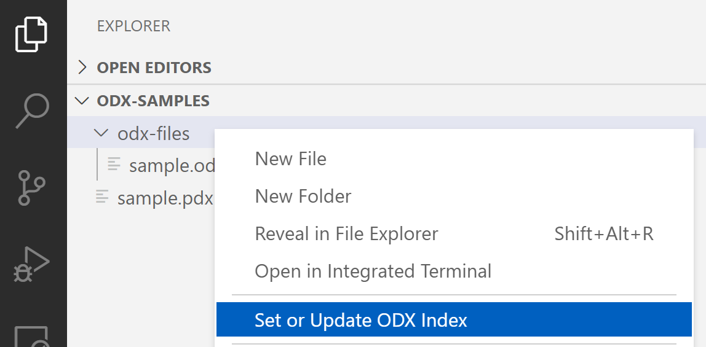
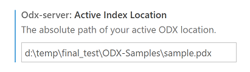
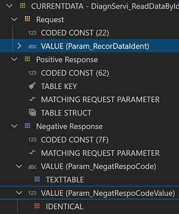
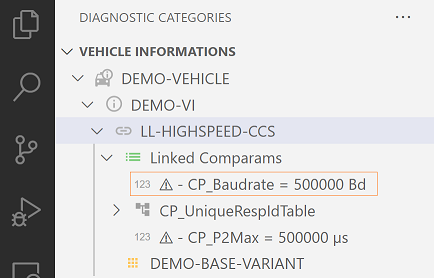

# ODX Commander

ODX Commander is a [Visual Studio Code](https://code.visualstudio.com/) extension for browsing and navigating diagnostic datasets in [ODX (ASAM MCD-2 D)](https://www.asam.net/standards/detail/mcd-2-d/) format.

It adds dedicated explorer views, ODX-aware navigation, and language-server-backed editing support for ODX documents.

## Key Features

Hierarchical explorer for logical diagnostic layers

Go to Definition for ODX references

Basic editing support for unpacked ODX files

Simplified read-only rendering for packed PDX content

For readability, packed content is rendered in a formatted and reduced view where less relevant XML details (for example admin metadata, OIDs, and namespace prefixes) are hidden.

Semantic folding ranges

Hover information for selected ODX elements

## Requirements

- Java 8 or newer must be installed.
- Visual Studio Code with extension support enabled.

## Quick Start

Choose an ODX source first. You can index either:

- A single packed PDX container (best for browsing).
- A folder with unpacked ODX files (best for browsing and editing).

### Option 1: Index a PDX file

1. Open a folder that contains your .pdx file.
2. In the Explorer context menu of that file, run Set or Update ODX Index.

### Option 2: Index unpacked ODX files

1. Open a folder that contains your unpacked ODX files.
2. Run Set or Update ODX Index from either:
	- the root folder, or
	- any ODX file inside that folder.

Both flows update the Active Index Location setting (odx-server.activeIndexLocation), which you can also change directly in VS Code settings.

## Views

### Diagnostic Layers

The Diagnostic Layers view shows the layer hierarchy:

- Protocols
- Functional Groups
- Shared Data
- Base Variants
- ECU Variants

Each item uses layer-specific coloring to indicate where a diagnostic element is defined in the ODX hierarchy.

### Diagnostic Categories

The Diagnostic Categories view includes:

- Vehicle Informations
- Comparams
- Comparam Subsets
- ECU Config
- Function Dictionary
- ECU Jobs
- Flash Data

### Vehicle Informations details

The Vehicle Informations tree lists all VEHICLE-INFO-SPEC documents from the active index and highlights key data in a compact structure.

For logical links using LINK-COMPARAM-REF, related parameters, values, and units are shown. Values that differ from defaults are marked with a warning indicator.

BASE-VARIANT-REF targets are selectable directly from the tree for faster navigation.

## Configuration

The extension exposes these core settings:

- odx-server.activeIndexLocation: Absolute path to the active ODX data source.
- odx-server.maxHeapSpace: Maximum Java heap for the language server (restart required).
- odx-server.trace.server: LSP trace level (off, messages, verbose).

## Known Issues

- Advanced diagnostics for malformed ODX XML are still limited.
- Be careful when editing source XML to avoid inconsistent model state.

