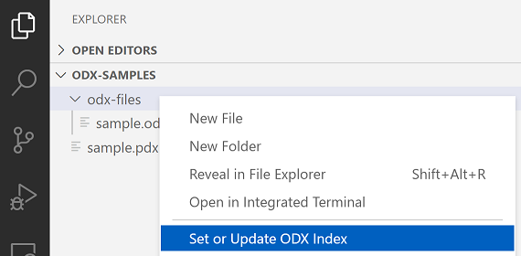

# ODX Commander

## Features

The ODX Commander extension allows fast navigation through large diagnostic data sets in [ODX](https://www.asam.net/standards/detail/mcd-2-d/) format. 

The extension installs two additional view containers.

* Diagnostic Layers
* Diagnostic Categories

'Diagnostic Layers' shows all relevant layer related information and the appropriate structure for.

* Protocols (Purple)
* Functional Groups (Blue)
* Shared Data (Red)
* Base Variants (Yellow)
* ECU Variants (Green)

Each layer is represented by a unique color to simply indicate at which location of the ODX hierarchy diagnostic elements are defined. (e.g. If request's icon is a yellow square the request is defined in a base variant)

'Diagnostic Categories' shows information about all other remaining ODX categories

* Vehicle Information
* Comparams
* Comparam Subsets
* ECU Config
* Function Dictionaries
* ECU Jobs
* Flash Data

## Getting Started

There are three options to select and index an ODX data source.

1. Open a folder that contains the PDX file in VS Code and select _**Set or Update ODX Index**_ for the selected PDX file.

1. Open a folder that contains unpacked ODX files in VS Code and select _**Set or Update ODX Index**_ for the selected folder or any ODX file within.

1. Set 'Active Index Location' directly in the extensions settings.

## Requirements

Java 8 or higher must be installed on your system.

## Known Issues

Unknown

## Release Notes

- Support for packed (PDX) and unpacked ODX files
- Hyperlink support for all ODX-Links in XML files
- The editor shows simplified and formatted ODX documents (e.g. removes admin data, company data, oids ...)

### 0.1.0

Initial release of ODX Viewer

