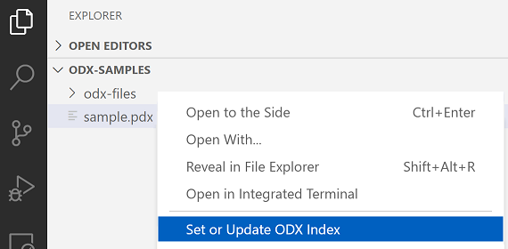

# ODX Commander

[Visual Studio Code](https://code.visualstudio.com/) extension that provides additional views and commands to browse diagnostic data sets in [ODX](https://www.asam.net/standards/detail/mcd-2-d/) format. 

## Features

Hierarchical viewer that shows logical layer structure

Goto definition support for ODX links

Basic editing support for unpacked ODX files

Formatted and simplified read-only view for packed ODX files

For the sake of readability all read-only PDX files are properly formatted and simplified. Unimportant information like admin data, OIDs or namespace prefixes is removed.
 

Folding ranges based on model semantics in order to leverage fold/unfold commands

Hover information for certain ODX elements

## Getting Started 

Before you can browse any data you have to choose an appropriate ODX data source first. If you intend to browse ODX data sets only, choose indexing a single PDX container. However if you want to edit ODX documents also, choose indexing a folder of upacked ODX files.

> **_NOTE:_**  Sophisticated error diagnostics for ODX documents is not yet provided. Be careful when editing underlying XML files to avoid erroneous state!

### Indexing PDX containers

Open a folder that contains the PDX file in VS Code and select _**'Set or Update ODX Index'**_ in the context menu of the selected PDX file.

### Indexing unpacked ODX files

Open a folder that contains all unpacked ODX files in VS Code and select _**'Set or Update ODX Index'**_ in the context of the selected folder or any contained ODX file.

- Both options above will automatically update the extension configuration _**'Active Index Location'**_ which you can also set in the settings editor directly.

## Diagnostic Layers

The **Diagnostic Layers** container shows layer related information and the appropriate structure for

* Protocols (Purple)
* Functional Groups (Blue)
* Shared Data (Red)
* Base Variants (Yellow)
* ECU Variants (Green)

Each layer is represented by a distinct color to indicate at which location in the ODX hierarchy a diagnostic element is defined. (e.g. if the request's icon is a yellow square the request is defined in a base variant)

## Diagnostic Categories

The **Diagnostic Categories** container shows information for the remaining ODX categories

* Vehicle Informations
* Comparams
* Comparam Subsets
* ECU Config
* Function Dictionaries
* ECU Jobs
* Flash Data

### Vehicle Information

**Vehicle Informations** overview lists all available **_VEHICLE-INFO-SPEC_** documents in the current ODX index and highlights most relevant information in a simple tree structure.

For any logical link that configures communication parametes via **_LINK-COMPARAM-REF_** all that parameters, values and appropriate units are shown. Parameter values that vary from their physical default values are prepended with a warning icon.

For convenience the logical links **_BASE-VARIANT-REF_** target is selectable in the tree.

## Requirements

Java 8 or higher must be installed on your system.

## Known Issues

Unknown

