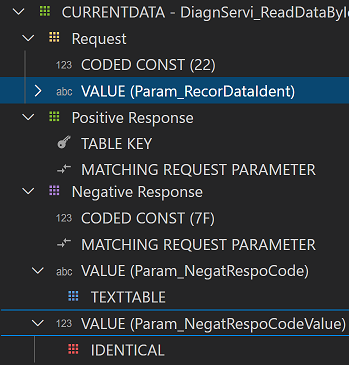
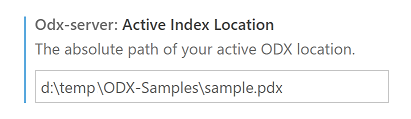

# ODX Commander

## Features

This extension allows fast navigation through large diagnostic data sets in [ODX](https://www.asam.net/standards/detail/mcd-2-d/) format. 

The extension installs the following view containers:

* Diagnostic Layers
* Diagnostic Categories

'Diagnostic Layers' views show layer related information and the appropriate structure for

* Protocols (Purple)
* Functional Groups (Blue)
* Shared Data (Red)
* Base Variants (Yellow)
* ECU Variants (Green)

Each layer is represented by a distinct color to simply indicate at which location in the ODX hierarchy a diagnostic element is defined. (e.g. if the request's icon is a yellow square the request is defined in a base variant)

'Diagnostic Categories' views show information for the remaining ODX categories

* Vehicle Information
* Comparams
* Comparam Subsets
* ECU Config
* Function Dictionaries
* ECU Jobs
* Flash Data

## Getting Started

The most important step is to select and index a single ODX data source. There are three options to achieve that.

Open a folder that contains the PDX file in VS Code and select _**Set or Update ODX Index**_ in the context menu of the selected PDX file.

Open a folder that contains all unpacked ODX files in VS Code and select _**Set or Update ODX Index**_ in the context of the selected folder or any contained ODX file.

Both options above will automatically update the extension configuration 'Active Index Location' which you can also set in the settings editro directly.

The indexing process might take some time. However 
You can switch different 
If you change an unpacked ODX file in the editor the change is not immediately reflected. However you can select _**Set or Update ODX Index**_ in the editors context menu.

## Requirements

Java 8 or higher must be installed on your system.

## Known Issues

Unknown

## Release Notes

- Support for packed (PDX) and unpacked ODX files
- Hyperlink support for ODX Links in XML files
- The editor shows simplified and formatted ODX documents (e.g. removes admin data, company data, oids ...)

### 0.1.0

Initial release of ODX Viewer

